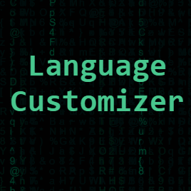

# Language Customizer
---


This is a repository for the website https://language-customizer.onrender.com/ made with vuejs and hosted on render

##### <ins>Local Hosting</ins>:
```shell
> npm install
> npm run build-dev
> npm start
```

##### <ins>Reporting an Issue</ins>:

You can open an issue for this repository under **Issues** tab